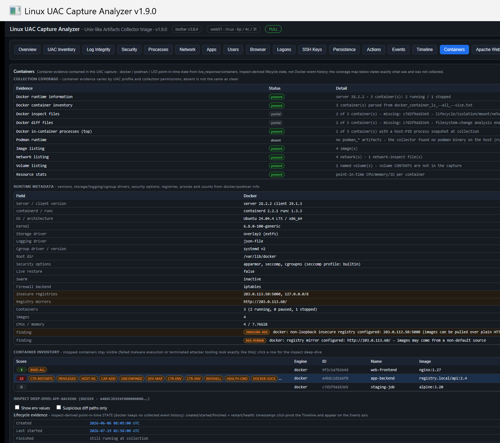

# Linux UAC Capture Analyzer

A single-file Windows **HTA** that analyzes the output of [**UAC** (Unix-like Artifacts Collector)](https://github.com/tclahr/uac) — the tarball a responder collects from a Linux host. Point it at the `uac-<host>-<os>-<timestamp>.tar.gz` (or an already-extracted folder); it extracts the archive with Windows' built-in `tar.exe` and turns the plain-text process, network, logon, log and filesystem-timeline artifacts into scored, searchable triage views — plus a self-contained HTML report.

**It never runs UAC and never touches the target host.** There is no SSH, no remote anything, and no parser engine to install — the tarball is the entire interface.

The "**Linux**" in the name is honest scoping: several parsers (binary `wtmp`/`btmp`/`lastlog` decode, `/proc`-based process analytics, systemd/journald artifacts) are Linux-specific. Captures from the other platforms UAC supports (macOS, \*BSD, Solaris, ESXi) still open, degrade gracefully to their text sources, and say so in the integrity notes.


> All screenshots use **synthetic demo data** (fictional host `web01`, documentation IPs).

## Why

UAC is excellent at *collecting* a Unix-like host. This tool is about *reading the result fast on a Windows analysis box* — surfacing the handful of rows that matter (a hidden process, a brute-forced login, a malicious cron job, a web-shell plant) out of a capture with tens of thousands of files, and doing it with no dependencies beyond the copy of `tar.exe` already on every modern Windows machine.

## Quick start

1. **On the Linux host**, download UAC from [its releases](https://github.com/tclahr/uac/releases) and run it from its own folder:
   ```
   cd uac-3.3.0
   ./uac -p ir_triage /tmp
   ```
2. **Copy** the resulting `uac-<host>-<os>-<ts>.tar.gz` to a Windows box.
3. **Open** `Linux-UAC-Analyzer.hta`, drop the tarball path in (or **Browse…**), confirm the target hostname, and click **Analyze capture**.
4. **Read Overview first**, then work the tabs. Anything scored **≥ 3** is flagged suspicious. **Generate report** writes the whole triage to one shareable HTML file.

## What it shows

Nineteen tabs:

| Tab | Built from | Highlights |
|---|---|---|
| **Overview** | `uac.log`, `os-release`, `uname`, `ip addr`, sar, cloud-init, `--list-boots` | System overview (distribution, kernel, host TZ), **network addresses** with friendly adaptor labels + link state, **observable-activity window**, **top external IPs** (geo-tagged), sar CPU summary, **boot history**, cloud-init baseline, dataset stat cards, cross-dataset **Top findings**, possible-ATT&CK mappings, **Generate report** |
| **Inventory** | ~60 key artifacts | Present/absent map with open-folder links to every raw file |
| **Security** | every parsed dataset + sshd/PAM/sudoers/sysctl/mounts/firewall/Apache config | Automated assessment scored **PASS / WARN / FAIL / N-A**: cross-dataset **attack-chain correlations** (brute-force that succeeded, public-IP / out-of-hours logins, download→chmod→exec, anti-forensics, persistence-after-intrusion, reused keys, timestomps) + a CIS/NIST-inspired **OS Hardening Posture** (root SSH, empty/blank passwords, extra UID-0, sudoers NOPASSWD, firewall on/off + non-standard listeners, SELinux/AppArmor, kernel sysctls, `/tmp` mount, NTP, patch recency, EOL distro) + an **Apache Hardening Posture** (CIS Apache 2.4). N-A when the source artifact wasn't collected — a logs-only or non-root capture never shows a false all-clear |
| **Processes** | `ps` + `/proc` + `top` + `lsof` | Tree view, hidden-from-ps synthesis, deleted binaries, LD_PRELOAD/memfd/deleted-fd, web-shell parentage, **suspicion-category filter** |
| **Network** | `ss` + `/proc/net` hex-decode | **Type column** (SSH/HTTP/SMB/RDP/… from ports), **Location column** (geo/ASN), public-IPs-only + multiselect filters, hidden-socket cross-check, **click a public IP → VirusTotal** |
| **Apps** | apt/dpkg history | Package installs with attribution, **Action** filter, **User-Requested** filter + **USER-REQ** labels (human `apt install` vs unattended-upgrade/cron noise), and a suspicious-only filter |
| **Containers** | `live_response/containers`: docker/podman info + version + `ps -a`/`container ls`, per-container **inspect** + **diff** + `top`/stats, image/network/volume listings, LXD tables | Scoped strictly to the evidence the capture holds — point-in-time state, never presented as Docker event history. A **collection-coverage map** first (present / partial / permission denied / command failed / not installed / not collected). **Runtime metadata** with findings (insecure registries, odd root dir, missing AppArmor/SELinux/seccomp, swarm, egress proxy). Inventory keeps **stopped containers** visible. Per-container **inspect deep-dive**: lifecycle (created/started/finished pivot the Timeline + join Events, labelled inspect-derived), execution config, **env values redacted by default** (LD_PRELOAD / public-endpoint / temp-path values surface as indicators), C2/implant lens over entrypoint+cmd+health-check, isolation scoring (privileged / docker.sock / host-ns / CapAdd / unconfined / root combos), mounts with Timeline pivots, published ports corroborated against host `ss` listeners, `docker top` rows linked to **host PIDs**. **docker diff** counts + scored suspicious paths (persistence / credentials / ld.so / SSH / web roots / anti-forensics deletions) with an explicit *path-and-type-only* caveat. `State.Pid` → host-process correlation escalates containers whose process is already flagged |
| **Users** | passwd, group, shadow, lastlog, homes | Per-account view with **Enabled** verdict, SSH-key and history counts, multiselect account filter, **By group** view |
| **SSH Keys** | `~/.ssh`, `/etc/ssh`, null-passphrase check | Key inventory: **authorized_keys** (inbound access, source-restriction + forced-command flags), per-user **identity keys** (public/private, passphrase state), **host keys**; short key-id to match a key across accounts; null-passphrase private keys flagged |
| **Logons** | auth.log (ISO + classic syslog), wtmp/btmp/lastlog, last/lastb | **Outbound SSH Connections** + **Inbound SSH & Interactive Logons** subheadings, **lateral-movement** evidence (known_hosts + ssh config + typed commands), **By source IP** aggregation, spray/brute-then-success detection, **brute-force-only** and **Non-Business Hours** filters, multiselect filters |
| **Persistence** | 30+ mechanisms | Config inventory + scored command lines: cron (+ `cron.{hourly,daily,weekly,monthly}` & anacron), systemd units/timers + **drop-in overrides** + `Environment=LD_PRELOAD` / socket / generators / trigger targets, authorized_keys (forced-command & `environment=`), rc.local (+RHEL) & init.d, ld.so.preload & `ld.so.conf.d`, motd & APT hooks, modprobe, XDG autostart, shell startup files, **PAM (auth/account/password/session)**, sshd auth-source config, cloud-init per-boot, D-Bus activation, and **RAT/C2 spots** (system profile.d, **SSH-login rc & sshrc**, **network-event hooks**, module-autoload, udev RUN, binfmt, at jobs). Every command line gets a **C2 tradecraft lens** (reverse-shell/backpipe/encoded-loader incl. php/ruby/gawk & `/dev/udp`, tunnels, beacon cadence, boundary-matched implant names, callback IPs / IPv6 / domains), and a **correlation** step escalates a persistence target that is a running process holding an established public connection (**PERS-C2**) |
| **Timeline** | TSK bodyfile | Full MAC-times, case-window filterable, **pivot ±15 min** target from any event |
| **Events** | all time-stamped datasets | One scored axis: logons, packages, boots, journal anomalies, web, audit, history; notable-events filter; click a timestamp to pivot the Timeline |
| **Apache Web Server** | apache2/httpd config (`/etc/apache2` \| `/etc/httpd`) + access logs | **Apache Configuration** summary (ServerTokens/Signature, TraceEnable, run-as user, modules, directory listing, mod_status) above the access logs; initial-access hunting on the logs: POSTs to scripts, traversal/encoded payloads, tool user-agents. Scored CIS checks on the Security tab |
| **Audit** | auditd | `execve` records (hex args decoded, auid attribution) + login events — the closest Linux gets to process-creation telemetry |
| **Actions** | bash/zsh/sh history | The full **executed-command record** per user, timestamped where the shell recorded times, scored across the **attacker playbook** (recon, credential access, scanners/offensive tools, download→chmod→exec, account & persistence edits, remote copy/SSH, anti-forensics, defence-evasion, elevation); per-user + **Non-Business Hours** filters, pivot to Timeline |
| **Browser** | user-profile SQLite DBs | Hand-off to the SQLECmd wrapper (Zimmerman maps parse Linux-collected Chrome/Firefox DBs unchanged) |
| **Logs** | journal filenames, syslog, kern.log, auditd summary | Log-integrity checks, journal rotation analysis, service inventory, notable events, optional **journal contents via WSL** |
| **IOC hits** | tree sweep + `hash_executables` | Line-scan of the whole tree plus SHA1 matches against dormant on-disk executables |



> The **Containers** tab (v1.9) is scoped to the point-in-time state a UAC capture actually holds — a collection-coverage map, docker/podman runtime metadata with findings, an inventory that keeps stopped containers visible, and a per-container inspect deep-dive (lifecycle, execution, isolation/exposure scoring, `docker diff`). It never claims Docker event history.

A **Non-Business Hours** filter on the time-based tabs (Logons, Actions, Events, Apache logs, Timeline) isolates activity outside **Mon–Fri 08:00–18:00 host-local, weekends included** — the collector's own timezone, not the analyst's. Optional **online geo/ASN enrichment** (checkbox, default on) tags public IPs with country + ASN across all views — only the bare IP list leaves the machine, and an `offline.txt` beside the app disables every outbound feature. Findings carry **possible MITRE ATT&CK technique mappings** (heuristic candidates, not confirmed behaviour). Rotated **`.gz` logs** are inflated automatically (into a per-run cache when the input is an extracted evidence folder — source evidence is never modified).


## Scoring

Rows are scored with additive rules; **≥ 3 is suspicious**. Highlights: IOC / SHA1 hit (+3), executable under a temp/ram path (+2), interactive/decoder shell one-liner (+2), running binary deleted from disk (+3), PID hidden from ps (+3), LD_PRELOAD in a process environment (+3), unrecognized memfd fileless descriptor (+3), hidden LISTEN socket (+3), brute-force-then-success (+3), service account with an interactive login (+3), new account with a login shell (+4), extra UID-0 account (+3), privileged container / docker.sock mount (+3), populated `ld.so.preload` (+3), non-`pam_*` shared object in a PAM directory (+3), null-passphrase SSH private key (+2), anti-forensics history commands (+2). Dual-use tooling installs (nmap, tcpdump, …) are tagged **TOOLING** — context, never counted as IOC. Desktop-runtime noise is explicitly tuned out. Full reference in the manual.

## Command line

```
mshta "Linux-UAC-Analyzer.hta" "<archiveOrFolder>" ["<outDir>"] [/auto] [/from:yyyy-MM-dd] [/to:yyyy-MM-dd]
```

`/auto` extracts and parses immediately; `/from` `/to` set a UTC case window (filters the timeline, logons and package activity — **never** affects scoring). A shared `IOC.txt` next to the app is auto-merged at launch.

## Evidence hygiene & provenance

- Extracted-**folder** input is treated as read-only evidence; generated files (gz cache, runinfo, exports, reports, run logs) land in the output directory only.
- Host-local timestamps (classic syslog, `last -F`, boot tables, apt/dpkg) are normalized to **UTC at ingest** using the collector's offset; a host-TZ toggle re-renders everywhere at once.
- A **hostname-mismatch gate** stops analysis if `uac.log` disagrees with the typed target host.
- `runinfo.json` records run id, app + UAC versions, collection profile, TZ offset, per-step parse timings; a full run log (`parse_log_*.txt`) is written beside it after every run.
- CSV exports neutralize formula-injection cells; binary utmp decode is gated to Linux glibc x86-64 with per-record plausibility checks.

## Full manual

See **[`UAC-Triage-Manual.html`](UAC-Triage-Manual.html)** — a self-contained field manual with a screenshot of every tab, the complete scoring reference, a triage methodology, and the notes/limitations.

## Notes

- Windows' `tar.exe` (bsdtar) **returns exit code 1** on UAC tarballs because they contain Unix symlinks Windows can't create — this is expected; success is judged by `uac.log` appearing, and the regular files all extract.
- Encrypted zips (UAC `-P`) can't be opened by bsdtar — extract with 7-Zip first and use **Pick folder…**.
- **Non-root captures** are first-class: the Overview states what's missing (shadow, sudoers, other users' /proc details), permission-denied caveats are summarized, and socket ownership lost from `ss` is recovered from `/proc/net` + fd inodes.
- **Long paths** are handled: the tool warns before extracting into a too-deep directory, audits the extracted tree via robocopy, and reports any unreadable files. Keep the **Output directory short** (e.g. `C:\Cases\<host>`).
- Upgrading from **UAC Triage Tool** (≤ v0.9.x): the self-update replaces the file in place under its old name — everything keeps working, and the sidecar files (`UAC-Triage-Tool.sqlecmd.txt`, `.colw.txt`) and `_Processed\<host>\UAC` output convention are intentionally unchanged.

## Requirements

Windows 10 1803+ (for the bundled `tar.exe`). No install, no admin required for reading a collected capture. Rotated-`.gz` inflation uses the built-in PowerShell + .NET `GzipStream` (no separate install).

## License

MIT © 2026 Ben Morris. UAC is a project of Thiago Canozzo Lahr ([tclahr/uac](https://github.com/tclahr/uac)); this is an independent analyzer for its output.
