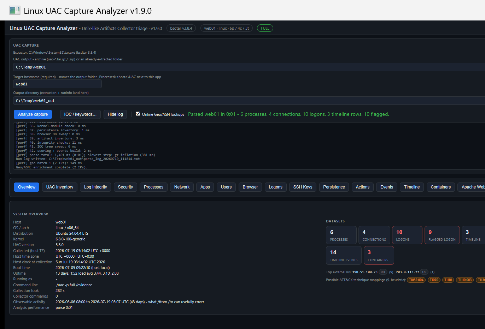
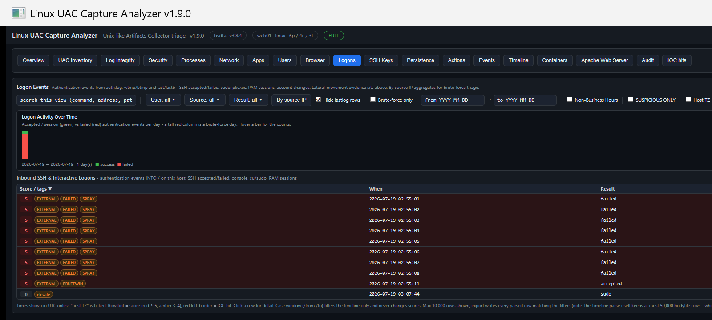

# UAC Triage Tool

A single-file Windows **HTA** that triages the output of [**UAC** (Unix-like Artifacts Collector)](https://github.com/tclahr/uac) — the tarball a responder collects from a Linux, macOS, \*BSD, Solaris or ESXi host. Point it at the `uac-<host>-<os>-<timestamp>.tar.gz` (or an already-extracted folder); it extracts the archive with Windows' built-in `tar.exe` and turns the plain-text process, network, logon and filesystem-timeline artifacts into scored, searchable triage views.

**It never runs UAC and never touches the target host.** There is no SSH, no remote anything, and no parser engine to install — the tarball is the entire interface.



> All screenshots use **synthetic demo data** (fictional host `web01`, documentation IPs).

## Why

UAC is excellent at *collecting* a Unix-like host. This tool is about *reading the result fast on a Windows analysis box* — surfacing the handful of rows that matter (a hidden process, a brute-forced login, a malicious cron job) out of a capture with tens of thousands of files, and doing it with no dependencies beyond the copy of `tar.exe` already on every modern Windows machine.

## Quick start

1. **On the \*nix host**, download UAC from [its releases](https://github.com/tclahr/uac/releases) and run it from its own folder:
   ```
   cd uac-3.3.0
   ./uac -p ir_triage /tmp
   ```
2. **Copy** the resulting `uac-<host>-<os>-<ts>.tar.gz` to a Windows box.
3. **Open** `UAC-Triage-Tool.hta`, drop the tarball path in (or **Browse…**), confirm the target hostname, and click **Analyze capture**.
4. **Read Overview first**, then work the tabs. Anything scored **≥ 3** is flagged suspicious.

## What it shows

Eight tabs:

| Tab | Built from | Highlights |
|---|---|---|
| **Overview** | `uac.log`, `uptime`, `date` | Run metadata incl. **boot time / uptime**, per-dataset stat cards, cross-dataset **Top findings**, scored **Persistence & system findings** (cron, systemd units **and timers**, accounts, suid/caps/hidden sweeps, **null-passphrase SSH keys**, shell histories), package activity (with attribution), **deep-inspected containers** (privileged / sensitive mounts / docker diff), integrity/journal-gap summaries, and a presence inventory |
| **Processes** | `ps -ef` + `/proc` maps + **`top`** + **per-PID /proc** | Hidden-from-ps processes **synthesized** into rows; deleted-binary detection; **%CPU/%MEM column**; processes **only top saw** (transient/miner); **LD_PRELOAD / memfd / deleted-fd / comm-masquerade** from per-PID environ/fd/maps |
| **Network** | `ss` / `netstat` + **`/proc/net`** | External connections; socket→process links; **hidden-socket cross-check** (in /proc/net but missing from ss); ownership **recovered on non-root captures** via uid + fd inodes |
| **Logons** | `auth.log` (**ISO-8601 + classic syslog**), **wtmp/btmp/lastlog binaries**, `last`, `lastb` | SSH accepted/failed, **sudo / pkexec / pam sessions / account changes / su**, per-account lastlog, spray + **BRUTEWIN** detection, service-account-login and new-login-account flags |
| **Timeline** | TSK bodyfile | Full filesystem MAC-times; case-window filterable; capped for MFT-scale captures |
| **Logs** | journal, syslog, kern.log, sysstat, cloud-init, `journalctl` | **Journal coverage + gap/generation-change detection**, a **boots table** (`journalctl --list-boots`, with between-boot gap checks), **log-integrity** checks, **syslog service inventory**, notable events (OOM, promiscuous, USB, kernel taint, timers/units), **sar** CPU summary, **cloud-init** provisioning baseline |
| **IOC hits** | tree sweep + `hash_executables` | Line-scan of the whole tree, **plus** SHA1 matches against on-disk (dormant) executables |
| **Inventory** | ~50 key artifacts | Present/absent map across nine categories, each with an "open folder" link to the raw file |

Rotated **`.gz` logs** under `[root]/var/log` are inflated at parse time, so weeks of rotated auth/syslog/dpkg/apt history are included automatically — usually where a logs-only capture's real activity lives.



## Scoring

Rows are scored with additive rules; **≥ 3 is suspicious**. Highlights: IOC / SHA1 hit (+3), executable under a temp/ram path (+2), interactive/decoder shell one-liner (+2), running binary deleted from disk (+3), PID hidden from ps (+3), **LD_PRELOAD in a process environment** (+3), **unrecognized memfd** fileless descriptor (+3), **hidden LISTEN socket** (in /proc/net, missing from ss, +3), service account running an interpreter seen only in top (+3), **brute-force-then-success** (+3), service account with an interactive login (+3), new account with a login shell (+4), **extra UID-0 account** (+3), privileged container / docker.sock mount (+3), a populated `ld.so.preload` (+3), null-passphrase SSH private key (+2), anti-forensics history commands (+2), a **journal gap with a generation change** (integrity, high sev), suspicious package installs (nmap/socat/xmrig/…), and more. Desktop-runtime noise (GNOME memfds, X11 lock files, upgraded-library deleted maps, renamed threads) is explicitly tuned out — verified against a real non-root ir_triage capture. Full reference in the manual.

## Command line

```
mshta "UAC-Triage-Tool.hta" "<archiveOrFolder>" ["<outDir>"] [/auto] [/from:yyyy-MM-dd] [/to:yyyy-MM-dd]
```

`/auto` extracts and parses immediately; `/from` `/to` set a UTC case window (filters the timeline, logons and package activity — **never** affects scoring). A shared `IOC.txt` next to the app is auto-merged at launch.

## Full manual

See **[`UAC-Triage-Manual.html`](UAC-Triage-Manual.html)** — a self-contained field manual with a screenshot of every tab, the complete scoring reference, a triage methodology, and the notes/limitations.

## Notes

- Windows' `tar.exe` (bsdtar) **returns exit code 1** on UAC tarballs because they contain Unix symlinks Windows can't create — this is expected; success is judged by `uac.log` appearing, and the regular files all extract.
- Encrypted zips (UAC `-P`) can't be opened by bsdtar — extract with 7-Zip first and use **Pick folder…**.
- Displayed times are **UTC** by default; a **host-TZ toggle** (Logons, Timeline, Logs) re-renders them in the collector's local time using the offset recorded in `uac.log`.
- **Non-root captures** are first-class: the Overview states what's missing (shadow, sudoers, other users' /proc details), permission-denied caveats are summarized (capped, not spammed), and socket ownership lost from `ss` is recovered from `/proc/net` + fd inodes.
- **Long paths** are handled: UAC captures nest ~170 chars deep, so a deep output directory can push files past Windows' 260-char limit. The tool warns before extracting into a too-deep directory, audits the extracted tree (via robocopy, which is long-path capable) and reports any unreadable files, and computes journal coverage from filenames so it survives regardless. Keep the **Output directory short** (e.g. `C:\Cases\<host>`) to include every file.
- Rotated-log inflation and the sar/journal parsers use **PowerShell** (already present on Windows 10+) for `.gz` decompression; if PowerShell is unavailable, rotated history simply stays compressed and everything else still works.

## Requirements

Windows 10 1803+ (for the bundled `tar.exe`). No install, no admin required for reading a collected capture. Rotated-`.gz` inflation uses the built-in PowerShell + .NET `GzipStream` (no separate install).

## License

MIT © 2026 Ben Morris. UAC is a project of Thiago Canozzo Lahr ([tclahr/uac](https://github.com/tclahr/uac)); this is an independent triage viewer for its output.
